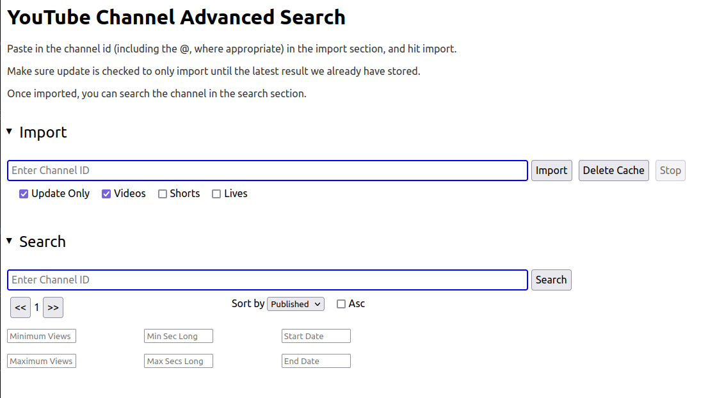

# YouTube Channel Advanced Search

Let's you import and search youtube channels based on multiple factors like published date range, view count, and video length.

## Usage

1.  Follow instructions for install and running below.

2.  Navigate to http://localhost:5000

3.  Enter a youtube channel id, and hit import.

4.  Once sufficient amount of videos is imported, enter the channel name in the search pane, and search according to criteria.

## Install

From repo root:

    npm run install

You may need to follow instructions for installing plawright.

## Run

From repo root:

    npm run start

